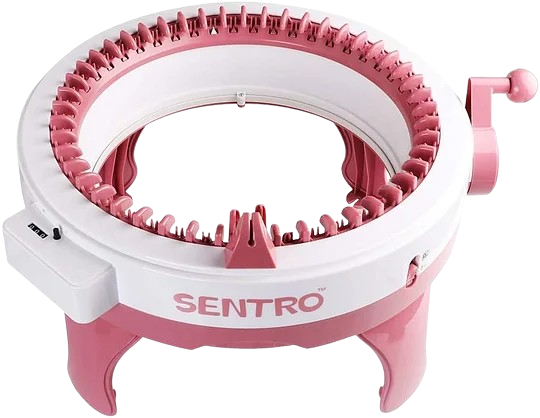

## From a Digital Design to Fabric

::: {.columns .v-center}
::: {.column width="50%"}

The idea behind this project draws inspiration from the operating principle of **3D printers**: starting from a digital model, they can automatically produce objects with **precision** and **repeatability**.

The objective of this work is to bring the same paradigm to textiles, by developing an **automated knitting machine** capable of producing knit patterns from a predefined digital design.

:::

::: {.column width="50%" style="text-align:right;"}
{fig-alt="Circular knitting machine" width=90%}

*Image source: [Sentro Official Website](https://www.sentroknittings.com/).*
:::
:::

---

## Project Sections

::: {.columns}
::: {.column width="33%"}

::: {.callout-note}
### User Guide

Create a PNG pattern and operate the prototype through the embedded display.

[Open →](operating-machine.qmd)
:::

:::

::: {.column width="33%"}

::: {.callout-note}
### Control System

Raspberry Pi, GFX HAT, ESP32, servo control and serial synchronization.

[Open →](control-system.qmd)
:::

:::

::: {.column width="33%"}

::: {.callout-note}
### Error Recognition

Real-time visual detection of yarn engagement defects.

[Open →](error-recognition.qmd)
:::

:::
:::

::: {.columns}
::: {.column width="50%"}

::: {.callout-note}
### Mechanical Design

Three-dimensional components, including the servo arms and camera support.

[Open →](components.qmd)
:::

:::

::: {.column width="50%"}

::: {.callout-note}
### Current Development Status

Implemented functions and planned next steps.

[Open →](future-developments.qmd)
:::

:::
:::
