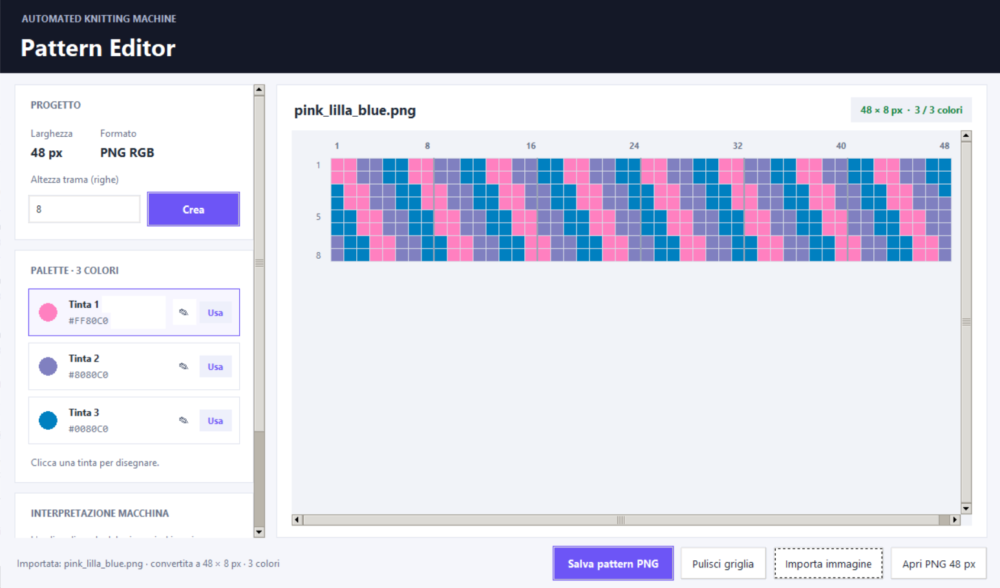
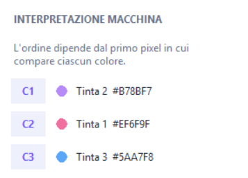

## Purpose

The Pattern Editor is the user-side tool used to create, edit and preview the textile pattern before running the machine.

The editor supports two different pattern creation methods:

- **Single Pattern**, where the user draws the complete final pattern directly on a 48-pixel-wide grid;
- **Repeated Pattern**, where the user creates an 8-pixel-wide module that is automatically repeated 6 times horizontally to obtain the required final width of 48 pixels.

The editor also allows the user to define the three yarn colours, preview the final pattern, open existing compatible PNG files and import external images.

The final pattern is exported as an RGB `.png` file and transferred to the Raspberry Pi through a USB flash drive.

{#fig-pattern-editor width="90%" fig-align="center"}

## Workflow

```text
Open the Pattern Editor
        ↓
Choose Single Pattern or Repeated Pattern
        ↓
Define the pattern height or module structure
        ↓
Select the three yarn colours
        ↓
Draw the pattern
        ↓
Check the final preview and colour mapping
        ↓
Export the final pattern as a PNG file
        ↓
Copy the PNG file to the USB flash drive
        ↓
Select the file from the machine display
```

## Editing Modes

### Single Pattern

In **Single Pattern** mode, the user draws the complete pattern directly.

The grid is always:

- **48 pixels wide**;
- variable in height.

Each row of the editor corresponds directly to one row of the exported PNG.

This mode is also used when opening an existing compatible PNG file or importing an external image.

### Repeated Pattern

In **Repeated Pattern** mode, the user works with modules that are:

- **8 pixels wide**;
- automatically repeated **6 times horizontally**.

The resulting final pattern is therefore always 48 pixels wide.

Two vertical construction methods are available.

#### Repeat Vertically

A single 8-pixel-wide module is created and repeated a selected number of times vertically.

For example:

```text
Module: 8 × 10 px

Horizontal repetition:
8 px × 6 = 48 px

Vertical repetition:
10 px × 4 = 40 px

Final pattern:
48 × 40 px
```

#### Different Modules

The pattern can also be built from multiple 8-pixel-wide modules.

Each module can have its own height and can be:

- created;
- duplicated;
- deleted;
- reordered;
- resized.

The modules are expanded to 48 pixels horizontally and then combined vertically to generate the final pattern.

In Repeated Pattern mode, the editor displays a non-editable preview of the actual 48-pixel-wide pattern that will be exported.

## Pattern Constraints

The current Pattern Editor and machine control software use the following final pattern properties:

| Parameter | Requirement |
|---|---|
| File format | `.png` |
| Colour mode | RGB |
| Image width | Exactly 48 pixels |
| Image height | From 1 to 1000 pixels |
| Number of colours | Exactly 3 distinct RGB colours |
| USB storage location | Files stored directly in the root folder of the USB drive |

The image height is not fixed. It determines the total number of rows contained in the pattern.

The editor prevents the PNG from being saved if the final pattern does not contain exactly three distinct colours.

## Colour Palette

The Pattern Editor contains a palette with three colours.

Each colour can be changed by the user before or during pattern creation.

The selected colour is used to paint cells in the editor grid.

The three palette colours must be different from one another.

All three colours must also appear at least once in the final pattern before the PNG can be exported.

## Automatic Colour Association

The final pattern is scanned in pixel order to determine the association between image colours and the three yarn-control commands.

The mapping is based on the **first occurrence of each distinct colour in the final 48-pixel-wide pattern**.

| Colour order in the final pattern | Command sent to ESP32 | Yarn actuator |
|---|---|---|
| First distinct colour found | `C1` | Servo 1 |
| Second distinct colour found | `C2` | Servo 2 |
| Third distinct colour found | `C3` | Servo 3 |

For example, if the first three distinct colours encountered in the final pattern are:

```text
Blue → Pink → Purple
```

the machine interpretation becomes:

```text
C1 / Servo 1 → Blue
C2 / Servo 2 → Pink
C3 / Servo 3 → Purple
```

The Pattern Editor displays this interpretation directly in the interface and shows it again after the PNG is saved.

{#fig-pattern-colour-mapping width="50%" fig-align="center"}

Before starting production, the real yarns must be positioned according to this colour-to-servo association.

## Opening an Existing Pattern

The Pattern Editor can open an existing PNG pattern.

A compatible file must:

- be exactly **48 pixels wide**;
- have a height between **1 and 1000 pixels**;
- contain exactly **three distinct colours**.

When an existing PNG is opened, it is loaded as a **Single Pattern**.

The original modular structure cannot be reconstructed from the exported PNG because the file only contains the final 48-pixel-wide image.

## Importing an Image

The Pattern Editor can also import external images in formats such as:

- PNG;
- JPEG;
- BMP;
- WebP.

The imported image is automatically:

1. converted to RGB;
2. resized proportionally to **48 pixels wide**;
3. reduced to **three colours**;
4. converted into an editable Single Pattern.

The aspect ratio is preserved when calculating the new height.

If the resulting image exceeds the maximum height of 1000 pixels, the import is rejected.

An image that cannot be reduced successfully to exactly three colours is also rejected.

## Exporting the Pattern

When **Save Pattern PNG** is selected, the editor first verifies that:

- the final pattern exists;
- its width is 48 pixels;
- its height does not exceed 1000 pixels;
- exactly three colours are used.

The file is then exported as an RGB PNG.

After saving, the editor displays:

- the final image dimensions;
- the association between the three colours and commands `C1`, `C2` and `C3`.

## Transfer to the Machine

Store the exported PNG files directly in the root folder of the USB flash drive:

```text
USB_DRIVE/
├── pattern_01.png
├── pattern_02.png
└── pattern_03.png
```

Do not place the pattern files inside subfolders.

After copying the files, safely eject the USB flash drive and connect it to the Raspberry Pi.

The machine interface will list the available PNG patterns on the GFX HAT display.

## Related Pages

- [Operating the Machine](operating-machine.qmd)
- [Display Interface — GFX HAT](display-interface.qmd)
- [Control System Overview](control-system.qmd)